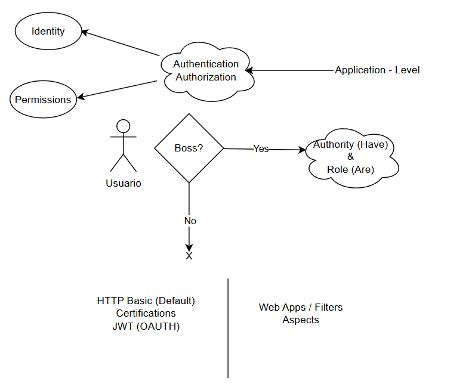
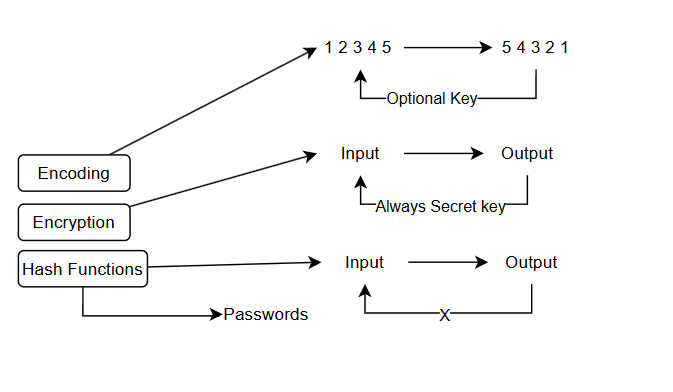
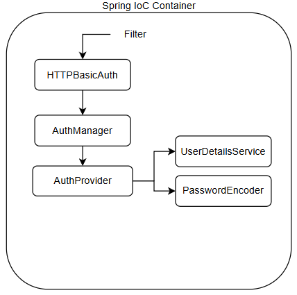
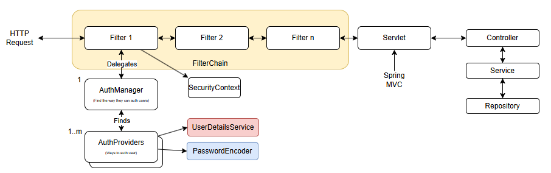
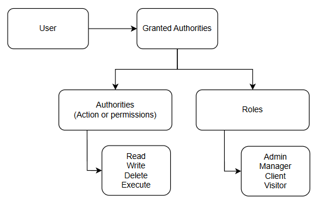

### Guía para el uso del módulo de Spring Security en Spring Boot

Para poder seguir de la mejor manera esta guía, te recomiendo empezar con el proyecto de Spring Boot que se encuentra en este enlace:
[Enlace de repositorio antes de Security](https://drive.google.com/file/d/17hJJ6hep5PHRg8BF6Dxmkakgk7-Pbbqw/view?usp=sharing)
A pesar de ello, esta guía podría serte útil para la configuración de Spring Security en cualquier proyecto de Spring Boot.

1. Para iniciar con Spring Security, es necesario agregar al `pom.xml` del proyecto el siguiente código:

```xml
    <dependency>
        <groupId>org.springframework.boot</groupId>
        <artifactId>spring-boot-starter-security</artifactId>
    </dependency>
```

2. Ejecuta el comando `mvn clean install` para instalar las dependencias.

3. Ejecuta el comando `mvn spring-boot:run` para correr la aplicación. A partir de agregar la dependencia de Spring Security, la aplicación se bloqueará ante cualquier solicitud y pedirá un usuario y contraseña. Por defecto, Spring Security crea un usuario llamado `user` y una contraseña aleatoria que se muestra en la consola al iniciar la aplicación.

4. Intenta hacer una solicitud para obtener la información de la aplicación, por ejemplo, intenta ingresar a `http://localhost:8080/projects`. Spring Security bloqueará la solicitud y pedirá un usuario y contraseña.

    4.1 Si estás usando Postman, puedes agregar un usuario y contraseña en la pestaña de `Authorization`. Selecciona el tipo `Basic Auth` y agrega el usuario y contraseña que se muestra en la consola al iniciar la aplicación.

5. Para poder modificar este usuario y contraseña, lo más adecuado será crear un archivo de configuración (anotado con `@Configuration`) y crear un bean de tipo `UserDetailsService`. En este bean, se puede modificar el usuario y contraseña por defecto.

    ```java
    @Configuration
    public class WebSecurityConfig {
        @Bean
        public UserDetailsService userDetailsService() {
            InMemoryUserDetailsManager userDetailsMngr = new InMemoryUserDetailsManager();

            UserDetails user = User.withUsername("miUsuario") // Cambiar el usuario
                    .password("123456") // Especificar la contraseña
                    .authorities("read") // Las authorities representan los roles o permisos que tiene el usuario
                    .build();
            
            userDetailsMngr.createUser(user); // Agregar el usuario a la lista de usuarios

            return userDetailsMngr; // Retornar la lista de usuarios
        }
    }
    ```

6. Además, es importante especificar un `PasswordEncoder` para que Spring Security pueda encriptar la contraseña. Se puede hacer de la siguiente manera:

    ```java
    public PasswordEncoder passwordEncoder() {
        return NoOpPasswordEncoder.getInstance(); // No usar para producción
        // return new BCryptPasswordEncoder(); // Más recomendable y generalmente usado, no usar si aún no has hecho el proceso de encriptación
    }
    ```

7. Si vuelves a ejecutar la aplicación, podrás ver que el usuario y contraseña por defecto ya no funcionan (además de que no aparece la contraseña autogenerada) y que ahora debes usar el usuario y contraseña que especificaste en el archivo de configuración.

#### Custom UserDetailsService

8. Crea una carpeta en `service` para los aspectos de autenticación, y ahí crea el `CustomDetailsService`. Este nos permitirá buscar un usuario en la base de datos por su nombre de usuario y no quemar el usuario y contraseña en el código.

    ```java
    public class CustomUserDetailsService implements UserDetailsService {
        
        @Override
        public UserDetails loadUserByUsername(String username) throws UsernameNotFoundException {
            return null;
        }
        
    }
    ```

9. Además de eso, ya podemos modificar nuestro bean de `UserDetailsService` para que use el `CustomUserDetailsService`. (O anotarlo con `@Service`).

    ```java
    @Bean
    public UserDetailsService userDetailsService() {
        return new CustomUserDetailsService();
    }
    ```

10. Es importante tener lista nuestra entidad de usuarios hasta este punto con sus repositorios y servicios creados. Añadiremos un nuevo servicio que permita buscar un usuario por su nombre de usuario (si aún no ha sido especificado).

    ```java
    @Service
    public class UserService {
        @Autowired
        private UserRepository userRepository;

        public User findByUsername(String username) {
            return userRepository.findByUsername(username);
        }
    }
    ```

11. Debemos inyectar la dependencia de `UserService` en nuestro `CustomUserDetailsService` para poder buscar el usuario por su nombre de usuario.

    ```java
    @Service
    public class CustomUserDetailsService implements UserDetailsService {
        @Autowired
        private UserService userService;

        @Override
        public UserDetails loadUserByUsername(String username) throws UsernameNotFoundException {
            User user = userService.findByUsername(username);
            return null;
        }
    }
    ```

12. Hasta aquí esto está incompleto debido a que el método `loadUserByUsername` debe retornar un objeto de tipo `UserDetails`. Para solucionar esto, debemos crear una clase que implemente la interfaz `UserDetails` y retornar una instancia de esta clase. Recomiendo entonces crear una carpeta `security` y crear ahí la clase `CustomUserDetails`.

    ```java
    @AllArgsConstructor
    public class SecurityUser implements UserDetails {

        private final User user;

        @Override
        public String getUsername() {
            return user.getUsername();
        }

        @Override
        public String getPassword() {
            return user.getPassword();
        }

        @Override
        public Collection<? extends GrantedAuthority> getAuthorities() {
            // GrantedAuthority es una interfaz que representa un permiso concedido a un objeto de autenticación.
            // Podemos crear una implementación personalizada de GrantedAuthority para representar nuestros propios permisos.
            // En este caso, estamos devolviendo una lista de permisos que el usuario tiene.
            return List.of(() -> "read");
        }
    }
    ```

13. Ahora, en nuestro `CustomUserDetailsService` ya podremos retornar una instancia de `SecurityUser` en el método `loadUserByUsername`.

    ```java
    @Override
    public UserDetails loadUserByUsername(String username) throws UsernameNotFoundException {
        Optional<User> user = userService.findByUsername(username);
        return user.map(SecurityUser::new) // Si hay un valor en el Optional, crea un nuevo SecurityUser con ese valor
                .orElseThrow(() -> new UsernameNotFoundException("Username not found" + username));
    }
    ```

14. Intentemos ejecutar la aplicación nuevamente y ver si podemos autenticarnos con el usuario y contraseña que hemos especificado en la base de datos.

#### Custom SecurityAuthorities

15. Hasta el momento se ha dejado quemado el rol del usuario en el método `getAuthorities` de la clase `SecurityUser`. Para poder hacer esto de manera más dinámica, se puede crear una clase que implemente la interfaz `GrantedAuthority` y retornar una lista de estas instancias en el método `getAuthorities`.

    ```java
    @AllArgsConstructor
    public class SecurityAuthority implements GrantedAuthority {

        private final Permission permission;

        @Override
        public String getAuthority() {
            return permission.getName();
        }
        
    }

    // En el método getAuthorities de SecurityUser
        @Override
        public Collection<? extends GrantedAuthority> getAuthorities() {
            List<SecurityAuthority> authorities = user.getUserRoles().stream()
                .map(UserRole::getRole) // Obtiene los roles de cada UserRole
                .flatMap(role -> role.getRolePermissions().stream()) // Obtiene los RolePermissions de cada Role
                .map(RolePermission::getPermission) // Obtiene los permisos de cada RolePermission
                .map(SecurityAuthority::new) // Convierte cada Permission en un SecurityAuthority
                .collect(Collectors.toList()); // Recopila todo en una lista
            return authorities;
        }
    ```

**Nota:** Aquí lanzará un error respecto al Lazy Loading, ya que estamos intentando obtener algo fuera del contexto de Hibernate. Por favor, soluciona este problema.

16. Después de realizar todo hasta este punto, ya deberías poder autenticarte con un usuario y contraseña que se encuentre en la base de datos. Pero además de eso, imprime antes de enviar la respuesta al usuario las authorities, y comprueba que tenga todas las authorities asignadas a ese usuario:

    ```java
    @GetMapping
    public String getAllProjects(Model model) {
        model.addAttribute("title", "Listado de proyectos");
        model.addAttribute("projects", projectService.findAll());
        Authentication auth = SecurityContextHolder.getContext().getAuthentication();
        auth.getAuthorities().forEach(authority -> System.out.println(authority.getAuthority()));
        return "projects/projectsList";
    }
    ```

**Nota:** Cometí un error, le puse pocos permisos al Rol de admin y todos al del usuario normal :c, por favor corrige el `data.sql`.

```sql
-- Inserts for user
INSERT INTO users(username, password, email) VALUES ('admin1', 'password1', 'email@email.com');
INSERT INTO users(username, password, email) VALUES ('user1', 'password1', 'emailuser@email.com');
```

#### Custom Authentication (Opcional)

Rara vez nos encontraremos con la necesidad de crear nuestro propio proceso de autenticación en Spring Security, por ejemplo, cuando no dependemos de un conjunto de usuarios en una base de datos, sino que necesitamos autenticar a los usuarios con un servicio externo o con una clave secreta. Para esto, Spring Security nos permite crear un proceso de autenticación personalizado.

1. Lo primero es crear un archivo de configuración que contenga un bean de tipo `SecurityFilterChain` y dentro de él especificaremos que al momento de llegar al filtro de `UsernamePasswordAuthenticationFilter`, se ejecute nuestro proceso de autenticación personalizado.

    ```java
    @Configuration
    @AllArgsConstructor
    public class SecurityConfig {

        private final CustomAuthenticationFilter customAuthenticationFilter;
        private final CustomAuthenticationManager customAuthenticationManager;

        // Autenticación personalizada
        @Bean
        public SecurityFilterChain customAuthFilterChain(HttpSecurity http) throws Exception {
            return http
                .securityMatcher("/customAuth/**")  // Aplica solo a rutas que comienzan con /customAuth
                .authenticationManager(customAuthenticationManager)
                .addFilterBefore(customAuthenticationFilter, UsernamePasswordAuthenticationFilter.class)
                .authorizeHttpRequests(auth -> auth
                    .anyRequest().authenticated()
                )
                .build();
        }

        // Autenticación por defecto
        @Bean
        public SecurityFilterChain defaultFilterChain(HttpSecurity http) throws Exception {
            return http
                    .securityMatcher("/**")  // Aplica a todas las demás rutas
                    .authenticationManager(customAuthenticationManager)
                    .authorizeHttpRequests(auth -> auth
                                    .anyRequest().authenticated()
                    )
                    .httpBasic(withDefaults())
                    .formLogin(withDefaults())
                    .build();
        }
    }
    ```

2. Ahora, realizaremos la creación del filtro personalizado `CustomAuthenticationFilter`, el cual buscará hacer una autenticación diferente a la que hace el `UsernamePasswordAuthenticationFilter`.

    ```java
    @Component
    public class CustomAuthenticationFilter extends OncePerRequestFilter {
        // También puedes implementar la interfaz Filter y sobrescribir el método doFilter
        // Pero por defecto, no puedes asumir que el filtro se llamará solo una vez por solicitud
        // Por lo tanto, puedes extender la clase OncePerRequestFilter para asegurarte de que el filtro se llame solo una vez por solicitud
        
        @Override
        protected void doFilterInternal(HttpServletRequest request, HttpServletResponse response, FilterChain filterChain)
                throws ServletException, IOException {

            filterChain.doFilter(request, response); // Solo cuando la autenticación funcionó
        }
        
    }
    ```

3. Teniendo en cuenta nuestro filtro, es necesario recordar que en los procesos de autenticación en Spring Security existen otros componentes como el `AuthenticationManager`, que se encargará de autenticar al usuario. Por lo tanto, es necesario crear un `CustomAuthenticationManager` que implemente la interfaz `AuthenticationManager` e inyectarla en el filtro.

    3.1 Agregar en la clase de `CustomAuthenticationFilter` la dependencia de `CustomAuthenticationManager` de forma que pueda ser llamada dentro del filtro.

    ```java
    @Component
    public class CustomAuthenticationFilter extends OncePerRequestFilter {

        @Autowired
        private CustomAuthenticationManager customAuthenticationManager;

        @Override
        protected void doFilterInternal(HttpServletRequest request, HttpServletResponse response, FilterChain filterChain)
                throws ServletException, IOException {
            String key = request.getHeader("key");

            if (key != null) {
                // Lógica de autenticación personalizada
                CustomAuthentication customAuthentication = new CustomAuthentication(false, key);
                Authentication authentication = customAuthenticationManager.authenticate(customAuthentication);

                if (authentication.isAuthenticated()) {
                    SecurityContextHolder.getContext().setAuthentication(authentication);
                    filterChain.doFilter(request, response); // Solo cuando la autenticación funcionó
                    return;
                }
            }

            // Lógica de autenticación por defecto
            filterChain.doFilter(request, response);
        }
    }
    ```

    3.2 Crear la clase de `CustomAuthenticationManager` que se encargará de autenticar al usuario con el proceso que hayamos especificado en el filtro.

    ```java
    public class CustomAuthenticationManager implements AuthenticationManager {
        
        @Override
        public Authentication authenticate(Authentication authentication) throws AuthenticationException {
            return null;
        }
    }
    ```

    3.3 Creamos la clase `CustomAuthentication` que implementa a `Authentication`. Esta representará en cierto momento al objeto autenticador que se enviará al `AuthenticationManager`.

    ```java
    @AllArgsConstructor
    @Setter
    @Getter
    public class CustomAuthentication implements Authentication {

        private final boolean authentication;
        private final String key;

        @Override
        public boolean isAuthenticated() {
            return authentication;
        }
        
        @Override
        public void setAuthenticated(boolean isAuthenticated) throws IllegalArgumentException {
            
        }

        @Override
        public Collection<? extends GrantedAuthority> getAuthorities() {
            return null;
        }

        @Override
        public String getName() {
            return null;
        }

        @Override
        public Object getCredentials() {
            return null;
        }

        @Override
        public Object getDetails() {
            return null;
        }

        @Override
        public Object getPrincipal() {
            return null;
        }
    }
    ```
    3.4 También es necesario crear un `CustomAuthenticationProvider` que implemente la interfaz `AuthenticationProvider`. Este se encargará de autenticar al usuario con el proceso que hayamos especificado en el filtro. En este caso, el usuario debe enviar una clave (`key`) en el encabezado (`header`) de la solicitud para poder ser autenticado.

    ```java
    @Component
    public class CustomAuthenticationProvider implements AuthenticationProvider {
        
        @Value("${custom.key}")
        private String key;

        @Override
        public Authentication authenticate(Authentication authentication) throws AuthenticationException {
            CustomAuthentication customAuthentication = (CustomAuthentication) authentication;
            String headerKey = customAuthentication.getKey();

            if (key.equals(headerKey)) {
                return new CustomAuthentication(true, null);
            }

            throw new BadCredentialsException("Credenciales incorrectas!!");
        }
        
        @Override 
        public boolean supports(Class<?> authentication) {
            // De esta manera, el CustomAuthenticationManager sabrá cuál AuthProvider usar
            return CustomAuthentication.class.equals(authentication); 
        }
    }
    ```

    3.5 Por último, es necesario inyectar el `CustomAuthenticationProvider` en el `CustomAuthenticationManager` para que pueda ser utilizado en el proceso de autenticación.

    ```java
    @Component
    @AllArgsConstructor
    public class CustomAuthenticationManager implements AuthenticationManager {

        private final CustomAuthenticationProvider customAuthenticationProvider;
        
        @Override
        public Authentication authenticate(Authentication authentication) throws AuthenticationException {
            if (customAuthenticationProvider.supports(authentication.getClass())) {
                return customAuthenticationProvider.authenticate(authentication);
            } // Aquí puedes agregar otros proveedores de autenticación

            throw new BadCredentialsException("No se pudo autenticar");
        }
    }
    ```

4. Para observar el correcto funcionamiento y no interrumpir la autenticación que ya teníamos, es necesario especificar una ruta diferente para el proceso de autenticación personalizado. En este caso, se ha especificado `/customAuth/**` como la ruta para el proceso de autenticación personalizado. Además, crearemos un controlador que acceda a dicha ruta.

    ```java
    @Controller
    @RequestMapping("/customAuth/projects")
    public class ProjectControllerCustomAuth {
        // Aquí iría la lógica del controlador
    }
    ```

5. Ahora que tenemos un `CustomAuthenticationManager`, es posible que falle la autenticación de los usuarios que se autenticaban con el `UserDetailsService` que habíamos creado anteriormente. Para solucionar esto, es necesario realizar algunos pasos adicionales que conecten ambos tipos de autenticación.

    5.1 En el archivo de configuración donde se encuentran los beans de `UserDetails`, debemos añadir un proveedor personalizado (`DaoAuthenticationProvider`) para que posteriormente sea verificado por el `AuthenticationManager`.

    ```java
    @Bean
    public DaoAuthenticationProvider daoAuthenticationProvider(UserDetailsService userDetailsService, PasswordEncoder passwordEncoder) {
        DaoAuthenticationProvider provider = new DaoAuthenticationProvider();
        provider.setUserDetailsService(userDetailsService);
        provider.setPasswordEncoder(passwordEncoder);
        return provider;
    }
    ```

    5.2 En el `CustomAuthenticationManager`, debemos inyectar tanto el `DaoAuthenticationProvider` como el `CustomAuthenticationProvider` para que puedan ser utilizados en el proceso de autenticación.

    ```java
    @Component
    @AllArgsConstructor
    public class CustomAuthenticationManager implements AuthenticationManager {

        private final CustomAuthenticationProvider customAuthenticationProvider;
        private final DaoAuthenticationProvider daoAuthenticationProvider;

        @Override
        public Authentication authenticate(Authentication authentication) throws AuthenticationException {
            // Si el tipo de autenticación es compatible con el CustomAuthenticationProvider, lo utilizamos
            if (customAuthenticationProvider.supports(authentication.getClass())) {
                return customAuthenticationProvider.authenticate(authentication);
            }
            // Si es compatible con el DaoAuthenticationProvider, lo utilizamos
            else if (daoAuthenticationProvider.supports(authentication.getClass())) {
                return daoAuthenticationProvider.authenticate(authentication);
            }
            // Si ningún proveedor soporta la autenticación, lanzamos una excepción
            throw new BadCredentialsException("No se pudo autenticar");
        }
    }
    ```

    5.3 Finalmente, añadiremos una nueva modificación al `SecurityFilterChain`, de manera que las solicitudes que comiencen con `/customAuth/` se autentiquen con el `CustomAuthenticationManager`, y las demás solicitudes se autentiquen con el `DaoAuthenticationProvider`.

    ```java
    @Configuration
    @AllArgsConstructor
    public class SecurityConfig {

        private final CustomAuthenticationFilter customAuthenticationFilter;
        private final CustomAuthenticationManager customAuthenticationManager;

        // Autenticación personalizada
        @Bean
        public SecurityFilterChain customAuthFilterChain(HttpSecurity http) throws Exception {
            return http
                .securityMatcher("/customAuth/**")  // Aplica solo a rutas que comienzan con /customAuth
                .authenticationManager(customAuthenticationManager)
                .addFilterBefore(customAuthenticationFilter, UsernamePasswordAuthenticationFilter.class)
                .authorizeHttpRequests(auth -> auth
                    .anyRequest().authenticated()
                )
                .build();
        }

        // Autenticación por defecto
        @Bean
        public SecurityFilterChain defaultFilterChain(HttpSecurity http) throws Exception {
            return http
                    .securityMatcher("/**")  // Aplica a todas las demás rutas
                    .authenticationManager(customAuthenticationManager)
                    .authorizeHttpRequests(auth -> auth
                                    .anyRequest().authenticated()
                    )
                    .httpBasic(withDefaults()) // Autenticación básica
                    .formLogin(withDefaults()) // Autenticación por formulario
                    .build();
        }
    }
    ```

6. Ahora, si intentamos acceder a la ruta `/customAuth/projects` y enviamos una clave (`key`) en el encabezado (`header`) de la solicitud, podremos ver que el proceso de autenticación personalizado se ejecuta y que podemos acceder a la ruta sin problemas. Por otro lado, si intentamos acceder a la ruta `/projects` y enviamos un usuario y contraseña, podremos ver que el proceso de autenticación por defecto se ejecuta y que podemos acceder a la ruta sin problemas.

*Morí :c*


### Ilustraciones de referencia




