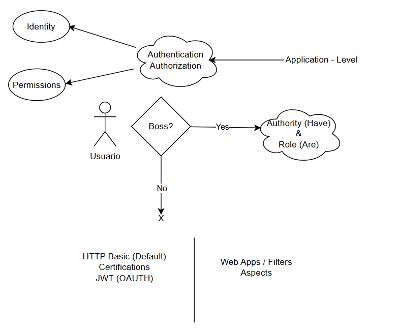
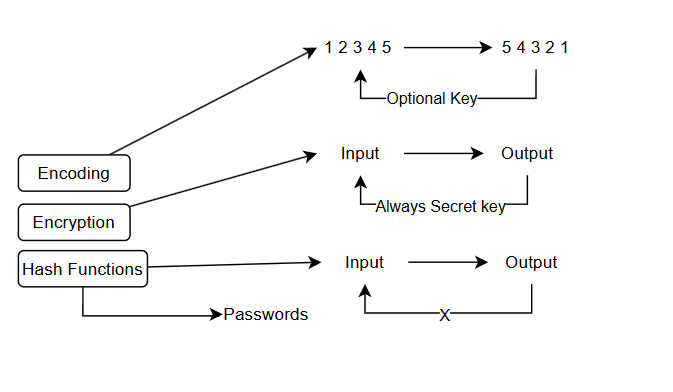
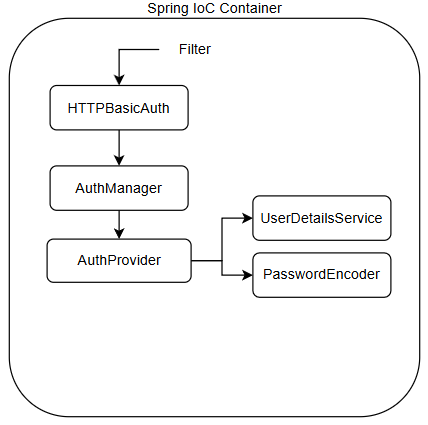
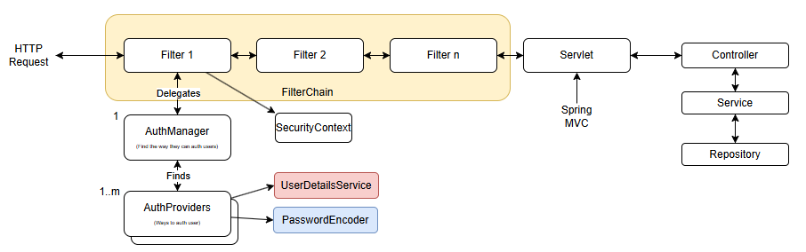
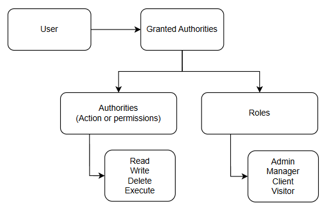

### Guía para el uso del módulo de Spring Security en Spring Boot

1. Agregar al pom o manejardor de dependencias de Spring Boot el siguiente código:
```xml
    <dependency>
        <groupId>org.springframework.boot</groupId>
        <artifactId>spring-boot-starter-security</artifactId>
    </dependency>
```

2. Ejecuta el comando `mvn clean install` para instalar las dependencias.

3. Ejecuta el comando `mvn spring-boot:run` para correr la aplicación. A partir de agregar la dependencia de Spring Security, la aplicación se bloqueará y pedirá un usuario y contraseña. Por defecto, Spring Security crea un usuario llamado `user` y una contraseña aleatoria que se muestra en la consola al iniciar la aplicación.

4. Intenta hacer una solicitud para obtener la información de la aplicación, por ejemplo intenta ingresar a `http://localhost:8080/projects`. Spring Security bloqueará la solicitud y pedirá un usuario y contraseña.

    4.1 Si estás usando Postman, puedes agregar un usuario y contraseña en la pestaña de Authorization. Selecciona el tipo Basic Auth y agrega el usuario y contraseña que se muestra en la consola al iniciar la aplicación.

5. Para poder modificar este usuario y contraseña, lo más adecuado será crear un archivo de configuración (Anotado con @Configuration) y crear un bean de tipo `UserDetailsService`. En este bean, se puede modificar el usuario y contraseña por defecto.

```java	
@Configuration
public class WebSecurityConfig {
    @Bean
    public UserDetailsService userDetailsService() {
        InMemoryUserDetailsManager userDetailsMngr = new InMemoryUserDetailsManager();

        UserDetails user = User.withUsername("miUsuario") // Cambiar el usuario
                .password("123456") // Especificar la contraseña
                .authorities("read") // Las authorities representan los roles o permisos que tiene el usuario
                .build();
        
        userDetailsMngr.createUser(user); // Agregar el usuario a la lista de usuarios

        return userDetailsMngr; // Retornar la lista de usuarios
    }
}
```

6. Además es importante especificar un `PasswordEncoder` para que Spring Security pueda encriptar la contraseña. Se puede hacer de la siguiente manera:

```java
    public PasswordEncoder passwordEncoder() {
        return NoOpPasswordEncoder.getInstance(); // No usar para prod
        // return new BCryptPasswordEncoder();
    }
```

7. Si vuelves a ejecutar la aplicación, podrás ver que el usuario y contraseña por defecto ya no funcionan (además de que no aparece la password autogenerada) y que ahora debes usar el usuario y contraseña que especificaste en el archivo de configuración.

#### Custom UserDetailsService

8. Crear una carpeta en service para los aspectos de autenticación, y ahí crear el CustomDetailsService.

```java
public class CustomUserDetailsService implements UserDetailsService {
    
    @Override
    public UserDetails loadUserByUsername(String username) throws UsernameNotFoundException {
        return null;
    }
    
}
```

9. Además de eso, ya podemos modificar nuestro bean de UserDetailsService para que use el CustomUserDetailsService. (O anotarlo con el @Service)

```java
    @Bean
    public UserDetailsService userDetailsService() {
        return new CustomUserDetailsService();
    }
```

10. Es importante tener lista nuestra entidad de usuarios hasta este punto con sus repositorios y servicios creados, añadiremos un nuevo servicio que permita buscar un usuario por su nombre de usuario.

```java
@Service
public class UserService {
    @Autowired
    private UserRepository userRepository;

    public User findByUsername(String username) {
        return userRepository.findByUsername(username);
    }
}
```

11. Debemos de inyectar la dependencia de UserService en nuestro CustomUserDetailsService para poder buscar el usuario por su nombre de usuario.

```java
@Service
public class CustomUserDetailsService implements UserDetailsService {
    @Autowired
    private UserService userService;

    @Override
    public UserDetails loadUserByUsername(String username) throws UsernameNotFoundException {
        User user = userService.findByUsername(username);
        return null;
    }
}
```

12. Hasta aquí esto está incompleto debido a que el método `loadUserByUsername` debe retornar un objeto de tipo `UserDetails`. Para solucionar esto, debemos de crear una clase que implemente la interfaz `UserDetails` y retornar una instancia de esta clase. Recomiendo entonces crear una carpeta `security` y crear ahí la clase `CustomUserDetails`.

```java
@AllArgsConstructor
public class SecurityUser implements UserDetails{

    private final User user;

    
    @Override
    public String getUsername() {
        return user.getUsername();
    }

    @Override
    public String getPassword() {
        return user.getPassword();
    }

    @Override
    public Collection<? extends GrantedAuthority> getAuthorities() {
        // GrantedAuthority is an interface that represents an authority granted to an Authentication object. Kinda like a permission.
        // We can create a custom implementation of GrantedAuthority to represent our own permissions.
        // In this case, we are returning a list of permissions that the user has.
        return List.of(() -> "read");
    }

}
```

13. Ahora, en nuestro CustomUserDetailsService, debemos de retornar una instancia de SecurityUser en el método `loadUserByUsername`.

```java
    @Override
    public UserDetails loadUserByUsername(String username) throws UsernameNotFoundException {
        Optional<User> user = userService.findByUsername(username);
        return user.map(SecurityUser::new) // If there is a value from the Optional, create a new SecurityUser with that value
                .orElseThrow(() -> new UsernameNotFoundException("Username not found" + username));
    }
```

14. Intentemos ejecutar la aplicación nuevamente y ver si podemos autenticarnos con el usuario y contraseña que hemos especificado en la base de datos.

#### Custom SecurityAuthorities

15. Hasta el momento se ha dejado `quemado` el rol del usuario en el método `getAuthorities` de la clase `SecurityUser`. Para poder hacer esto de manera más dinámica, se puede crear una clase que implemente la interfaz `GrantedAuthority` y retornar una lista de estas instancias en el método `getAuthorities`.

```java
@AllArgsConstructor
public class SecurityAuthority implements GrantedAuthority{

    private final Permission permission;

    @Override
    public String getAuthority() {
        return permission.getName();
    }
    
}

// En el método getAuthorities de SecurityUser
    @Override
    public Collection<? extends GrantedAuthority> getAuthorities() {
        List<SecurityAuthority> authorities = user.getUserRoles().stream()
            .map(UserRole::getRole) // Obtiene los roles de cada UserRole
            .flatMap(role -> role.getRolePermissions().stream()) // Obtiene los RolePermissions de cada Role
            .map(RolePermission::getPermission) // Obtiene los permisos de cada RolePermission
            .map(SecurityAuthority::new) // Convierte cada Permission en un SecurityAuthority
            .collect(Collectors.toList()); // Recopila todo en una lista
        return authorities;
    }
```

Nota: Aquí lanzará un error respecto al Lazy Loading, estamos intentando obtener algo fuera del contexto de hibernate, por favor solucionalo :)

16. Después de realizar todo hasta este punto, ya deberías de poder autenticarte con un usuario y contraseña que se encuentre en la base de datos. Pero además de eso, imprime antes de enviar la respuesta al usuario las autoridades, y comprueba que tenga todas las autorities asignadas a ese usuario:

```java
    @GetMapping
    public String getAllProjects(Model model) {
        model.addAttribute("title", "Listado de proyectos");
        model.addAttribute("projects", projectService.findAll());
        Authentication auth = SecurityContextHolder.getContext().getAuthentication();
        auth.getAuthorities().forEach(authority -> System.out.println(authority.getAuthority()));
        return "projects/projectsList";
    }
```

Nota: Cometí un error, le puse pocos permisos al Rol de admin y todos al del usuario normal :c, por favor corrige el data.sql

```sql
-- Inserts for user
INSERT INTO users(username, password, email) VALUES ('admin1', 'password1', 'email@email.com');
INSERT INTO users(username, password, email) VALUES ('user1', 'password1', 'emailuser@email.com');
```


### Ilustraciones de referencia




